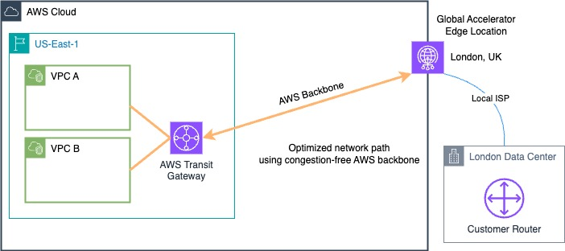

# Transit Gateway with Accelerated Site-to-Site VPN

## Description

This AWS CloudFormation template deploys network infrastructure with two spoke VPCs connected through a Transit Gateway, including an Accelerated Site-to-Site VPN. The Accelerated Site-to-Site VPN uses AWS Global Accelerator to optimize the routing path by leveraging AWS's global network infrastructure. This minimizes network latency and improves access speeds by routing user traffic through the nearest AWS edge location. You can use an accelerated VPN connection to avoid network disruptions that might occur when traffic is routed over the public internet.

## Architecture

  

When you create an accelerated VPN connection, we create and manage two accelerators on your behalf, one for each VPN tunnel. You cannot view or manage these accelerators yourself by using the AWS Global Accelerator console or APIs.

## Deployment Steps

### Deploying AWS Resources using AWS CloudFormation

To deploy the CloudFormation template from the AWS console, you can follow these steps:

1. **Clone GitHub repository**
   - Run the `git clone ${repoURL}` terminal command to download the repository

2. **Access CloudFormation Service**:
   - Open the AWS Management Console and navigate to the CloudFormation service. You can search for "CloudFormation" in the search bar at the top of the console. [CloudFormation Console](https://console.aws.amazon.com/cloudformation/).

3. **Create Stack**:
   - Click on the orange "Create stack" button.

4. **Specify Template**:
   - Choose "Upload a template file" option.
   - Click "Browse" and select the CloudFormation template file `Deployment.yaml`
   - Click "Next".

5. **Specify Stack Details**:
   - Enter a unique name for your CloudFormation stack (e.g., "test-deployment-stack").
   - Click "Next".

6. **Configure Parameters**:
   - The console will display all the parameters defined in the template (VPV CIDR Blocks, BGP ASNs, etc.).
   - Provide values for each parameter according to your requirements. Refer to the parameter descriptions in the template for guidance.
   - Click "Next".

7. **Review and Create**:
   - Review the details of your stack creation, including resources, parameters, and outputs.
   - If everything looks good, check the box next to "I acknowledge that AWS CloudFormation might create AWS resources for you. Charges may apply."
   - Click the orange "Create stack" button to initiate the deployment.

8. **Monitor Stack Status**:
   - The CloudFormation console will display the status of your stack creation. It may take a few minutes to complete depending on the resources involved.
   - You can monitor the progress and view any potential errors that might occur during deployment.

9. **Outputs**:
   - Once the stack creation is successful, the "Outputs" section will display the generated values like VPCs, and Transit Gateway etc.

By following these steps, you have accomplished the deployment of your CloudFormation template via the AWS Management Console.
 

## Next Steps

After successfully deploying the CloudFormation template, you need to configure your customer router or on-premises gateway to establish the Site-to-Site VPN connection with AWS.

1. In the AWS Management Console, navigate to the VPC Console.

2. In the left-hand navigation pane, under `Virtual Private Network (VPN)`, click on `Site-to-Site VPN Connections`.

3. Click on the VPN Connection deployed by cloudformation, then click the `Download configuration` button

4. Select the Vendor, platform and software version related to your customer router being used. 

5. Log into your customer router and paste the sample configuration provided, modify configuration as needed. 

6. Click on `Tunnel details` tab to view status of tunnel configurations.

7. Once tunnels are in the `UP` status you may provision AWS resources as needed to test connectivity.

## Considerations

1. **Security Groups**: The template does not define any security groups for the VPCs. Consider adding security groups to control inbound and outbound traffic for resources you might deploy in these VPCs.

2. **High Availability**: Currently, all subnets are created in the first availability zone. For high availability, consider creating subnets in multiple availability zones.

3. **Internet Access**: If you need internet access for instances in the private subnets, consider adding NAT Gateways or NAT Instances.

4. **Nested Stacks**: Consider using nested stacks for better manageability, especially if you plan to add more resources in the future. Nested stacks allow you to modularize your infrastructure and make it easier to maintain and update individual components.

## Clean Up

Follow these steps to properly remove the resources and ensure that your AWS account do not continue to be charged.

1. **Delete AWS CloudFormation Stacks**: Navigate to the AWS CloudFormation console and delete the stack you have deployed. This action removes all resources associated with those stacks, including Amazon VPC, Transit Gateway, Site-Site VPN, and any other related services.

By following these clean-up steps, you ensure that all temporary configurations and resources are properly decommissioned.

## Author
[Jose Alvarez](https://www.linkedin.com/in/jose-alvarez-3a71a2107/)
